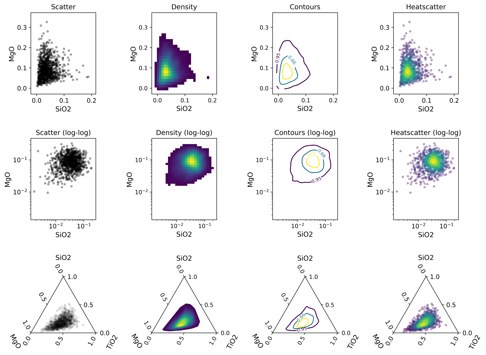

<!-- 250-1000 words -->

``pyrolite`` is a Python package for working with multivariate geochemical data, with a particular focus on rock and mineral chemistry.
The project aims to contribute to more robust, efficient and reproducible data-driven geochemical research.

# Features

``pyrolite`` provides tools for processing, transforming and visualising geochemical data from common tabular formats.
The package includes methods to recalculate and rescale whole-rock and mineral compositions, perform compositional statistics and create appropriate visualisations and also includes numerous auxiliary utilities (e.g. a geological timescale).
In addition, these tools provide a foundation for preparing data for subsequent machine learning applications using ``scikit-learn``  [@Pedregosa2011].

Geochemical data are compositional (i.e. sum to 100%), and as such require non-standard statistical treatment [@Aitchison1984]. While challenges of compositional data have long been acknowledged [e.g. @Pearson1897], appropriate measures to account for this have thus far seen limited uptake by the geochemistry community. The submodule ``pyrolite.comp`` provides access to methods for transforming compositional data, facilitating more robust statistical practises.

A variety of standard diagram methods (e.g. ternary, spider, and data-density diagrams; see Figs. 1, 2), templated diagrams [e.g. the Total-Alkali Silica diagram , @LeBas1992; and Pearce diagrams, @Pearce2008] and novel geochemical visualisation methods are available.
The need to visualise geochemical data (typically graphically represented as bivariate and ternary diagrams) has historically limited the use of multivariate measures in geochemical research.
Together with the methods for compositional data and utilities for dimensional reduction via ``scikit-learn``, ``pyrolite`` eases some of these difficulties and encourages users to make the most of their data dimensionality.
Further, the data-density and histogram-based methods are particularly useful for working with steadily growing volumes of geochemical data, as they reduce the impact of 'overplotting'.

Reference datasets of compositional reservoirs (e.g. CI-Chondrite, Bulk Silicate Earth, Mid-Ocean Ridge Basalt) and a number of rock-forming mineral endmembers are installed with ``pyrolite``.
The first of these enables normalisation of composition to investigate relative geochemical patterns, and the second facilitates mineral endmember recalculation and normative calculations.

``pyrolite`` also includes some specific methods to model geochemical patterns, such as the lattice strain model for trace element partitioning of @Blundy2003, the Sulfur Content at Sulfur Saturation (SCSS) model of @Li2009, and orthogonal polynomial decomposition for parameterising Rare Earth Element patterns of @ONeill2016.

Extensions beyond the core functionality are also being developed, including ``pyrolite-meltsutil`` which provides utilities for working with ``alphaMELTS`` and it's outputs [@Smith2005], and is targeted towards performing large numbers of related melting and fractionation experiments.

# API

The ``pyrolite`` API follows and builds upon a number of existing packages, and where relevant exposes their API, particularly for ``matplotlib`` [@Hunter2007] and ``pandas`` [@McKinney2010].
In particular, the API makes use of dataframe accessor classes provided by ``pandas`` to add additional dataframe 'namespaces' (e.g. accessing the ``pyrolite`` spiderplot method via `df.pyroplot.spider()`).
This approach allows ``pyrolite`` to use more familiar syntax, helping geochemists new to Python to hit the ground running, and encouraging development of transferable knowledge and skills.

![Standard and density-mode spider diagrams generated from a synthetic dataset centred around an Enriched- Mid-Ocean Ridge Basalt composition [@Sun1989], normalised to Primitive Mantle [@Palme2014]. Elements are ordered based on a proxy for trace element 'incompatibility' during mantle melting [e.g. as used by @Hofmann2014].](sphx_glr_spider_005.png)

# Conventions

<dl>
<dt>
Tidy Geochemical Tables
</dt>

Being based on ``pandas``, ``pyrolite`` operations are based on tabular structured data in dataframes, where each geochemical variable or component is a column, and each observation is a row [consistent with 'tidy data' principles, @Wickham2014].
``pyrolite`` additionally assumes that geochemical components are identifiable with either element- or oxide-based column names (which contain only one element excluding oxygen, e.g. $Ca$, $MgO$, $Al_2O_3$, but not $Ca_3Al_3(SiO_4){_3}$ or $Ti\_ppm$).

<dt>
Open to Oxygen
</dt>

<dd>
Geochemical calculations in ``pyrolite`` conserve mass for all elements excluding oxygen (which for most geological scenarios is typically in abundance).
This convention is equivalent to assuming that the system is open to oxygen, and saves accounting for a 'free oxygen' phase (which would not appear in a typical subsurface environment).
<dd>

</dl>

# Community

``pyrolite`` aims to be designed, developed and supported by the geochemistry community.
Community contributions are encouraged, and will help make ``pyrolite`` a broadly useful toolkit and resource (for both research and education purposes).
In addition to developing a library of commonly used methods and diagram templates, these contributions will contribute to enabling better research practices, and potentially even establishing standards for geochemical data processing and analysis within the user community.

# Acknowledgements

The authors of this publication (listed in reverse alphabetical order) have all contributed to the development of ``pyrolite`` at an early stage.

# References
